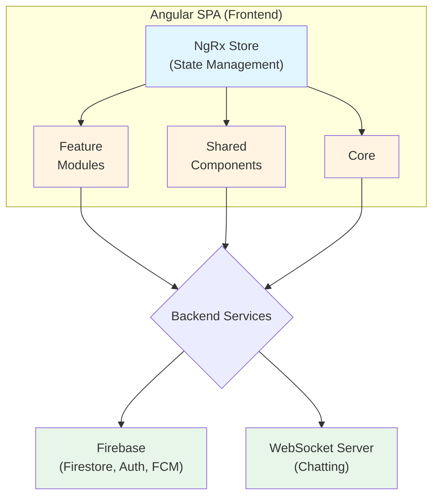
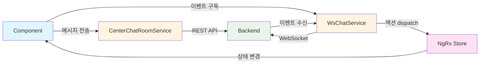
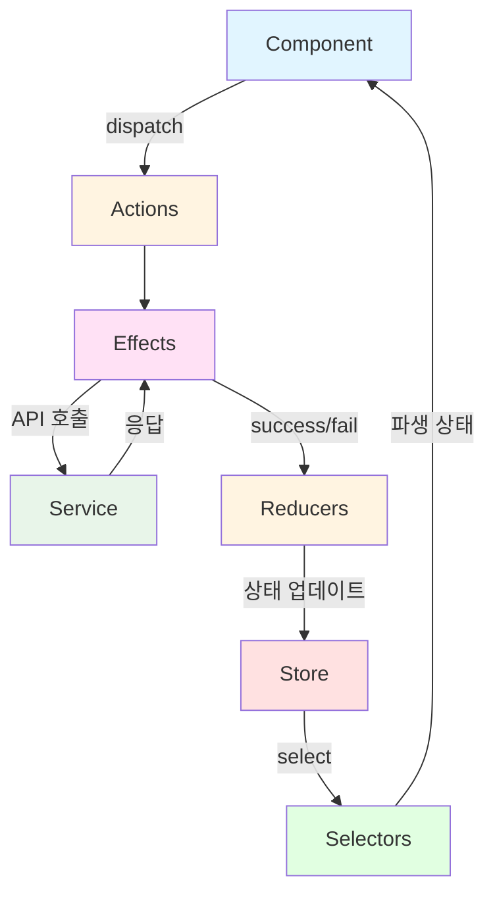
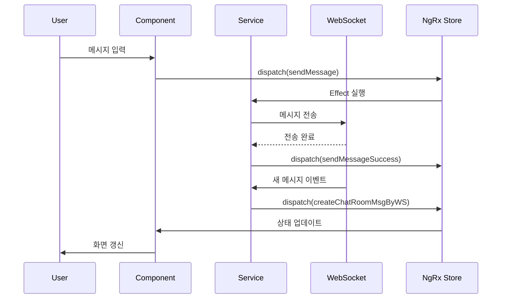
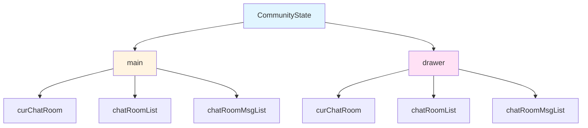

# Redwhale - 피트니스 센터 관리 플랫폼

> Angular 13 기반의 피트니스 센터 통합 관리 SaaS 플랫폼


<!-- 스크린샷 이미지를 docs/images/ 폴더에 추가해주세요 -->

## 📋 프로젝트 개요

**Redwhale**는 피트니스 센터의 회원 관리, 스케줄, 결제, 커뮤니케이션을 하나의 플랫폼으로 통합한 클라우드 기반 SaaS 솔루션입니다.

### 개발 배경
전통적인 피트니스 센터는 회원 관리, 스케줄 관리, 결제 시스템이 분리되어 있어 운영 효율성이 낮았습니다. 이를 해결하기 위해 모든 기능을 통합하고, 실시간 동기화와 직관적인 UX를 제공하는 올인원 솔루션을 개발했습니다.

### 주요 타겟
- 중소형 피트니스 센터 운영자
- 퍼스널 트레이닝 스튜디오
- 요가/필라테스 센터
- 크로스핏 박스

### 프로젝트 정보
- **회사**: RedWhale
- **개발 기간**: 2020.08 ~ 2023.08 (3년)
- **직무**: Frontend Engineer (Angular, TypeScript)
- **팀 구성**: 5명 (기획 2, 디자인 1, 개발 2)
- **배포**: [redwhale.xyz](https://redwhale.xyz) (프로덕션), [dev.redwhale.xyz](https://dev.redwhale.xyz) (개발)

---

## 🎯 주요 기능

### 1. 회원 관리 시스템


- **회원 등록 및 관리**: 회원 정보, 프로필 사진, 메모 관리
- **회원권 관리**:
  - 등록, 양도, 재등록, 환불 처리
  - 기간제/횟수제 회원권 지원
  - 홀딩(일시정지) 기능
  - 잔여 기간/횟수 자동 계산
- **락커 관리**: 락커 배정, 이동, 반납
- **출석 관리**:
  - 터치패드/키오스크 자동 출석
  - 수동 출석 체크
  - 출석 통계 및 분석
- **계약서 관리**: 디지털 서명 기반 전자 계약서 작성

### 2. 스케줄 및 예약 관리


- **FullCalendar 기반 일정 관리**:
  - 일/주/월별 보기 지원
  - 강사별 스케줄 보기
  - 드래그 앤 드롭으로 일정 이동
- **수업 예약 시스템**:
  - 실시간 예약 현황 확인
  - 예약 가능 인원 자동 계산
  - 예약 취소 및 대기자 관리
- **반복 일정 설정**: 요일별 반복 수업 자동 생성
- **운영시간 관리**: 센터별 운영시간 설정 및 24시간 운영 옵션

### 3. 결제 및 매출 관리
- **결제 내역 관리**: 회원권, 락커, 기타 상품 결제 이력
- **미수금 관리**: 미수금 추적 및 알림
- **환불 처리**: 잔여 기간/횟수 기반 환불 금액 자동 계산
- **매출 통계**:
  - 일/주/월별 매출 분석
  - 현금/카드/계좌이체/미수금 구분
  - 매출 증감률 시각화

### 4. 커뮤니케이션


- **실시간 채팅**:
  - WebSocket 기반 1:1 및 그룹 채팅
  - 파일 전송 기능
  - 읽지 않은 메시지 카운트
  - 멀티 디바이스 동기화
- **SMS 문자 발송**:
  - 개별/단체 문자 발송
  - 자동 문자 발송 (만료 예정, 미수금 알림)
  - 광고성 문자 법규 준수
  - 발신번호 등록 관리

### 5. 센터 관리
- **다중 센터 지원**: 하나의 계정으로 여러 센터 관리
- **권한 관리**:
  - 4단계 권한 (관리자, 운영자, 강사, 회원)
  - 기능별 접근 권한 제어
- **센터 설정**:
  - 공지사항 및 이용약관 설정
  - 센터 배경 이미지
  - 터치패드/키오스크 모드

### 6. 사용자 인증 및 보안
- **카카오톡 소셜 로그인**
- **이메일 로그인** 및 회원가입
- **비밀번호 재설정** (이메일 인증)
- **Google reCAPTCHA v3** 봇 방지

---

## 🛠 기술 스택

### Frontend
- **Core**: Angular 13.2.5, TypeScript 4.4.3
- **상태 관리**: NgRx 13 (Store, Effects, Entity, Router Store)
- **반응형 프로그래밍**: RxJS 7.4
- **불변성 관리**: Immer 9.0.12, ngrx-immer

### Backend & Infrastructure
- **BaaS**: Firebase 9.4.0
  - Authentication (이메일, 소셜 로그인)
  - Firestore (실시간 NoSQL DB)
  - Storage (파일 저장소)
- **실시간 통신**: WebSocket (채팅)
- **배포**: AWS S3 + CloudFront CDN

### UI/UX 라이브러리
- **FullCalendar 5.10**: 스케줄 관리
- **ng2-dragula 2.1**: 드래그 앤 드롭
- **angular-gridster2 13.1**: 그리드 레이아웃
- **signature_pad 4.0**: 전자 서명
- **ngx-skeleton-loader 4.0**: 로딩 스켈레톤 UI
- **ngx-spinner 13.0**: 로딩 스피너

### 유틸리티
- **dayjs 1.10**: 경량 날짜 라이브러리
- **lodash 4.14**: 유틸리티 함수
- **qrcode 1.5**: QR 코드 생성
- **file-saver 2.0**: 파일 다운로드

### 개발 도구
- **빌드**: Angular CLI 13.2.5
- **코드 품질**: ESLint, Prettier
- **테스트**: Karma, Jasmine

---

## 🏗 아키텍처 및 설계

### 전체 아키텍처


### 디렉토리 구조
```
src/app/
├── core/                    # 핵심 인프라
│   ├── services/           # API 서비스 레이어 (49개 서비스)
│   ├── guards/             # 라우트 가드 (14개)
│   ├── interceptor/        # HTTP 인터셉터
│   └── schema/             # TypeScript 타입 정의
│
├── feature/                # 기능 모듈 (Lazy Loading)
│   ├── homepage/           # 공개 홈페이지
│   │   ├── main/
│   │   ├── fare-guide/    # 요금 안내
│   │   └── customer-center/
│   │
│   └── redwhale/           # 인증 필요 영역
│       ├── auth/           # 로그인, 회원가입
│       ├── redwhale-home/  # 센터 대시보드
│       └── center/         # 센터 관리
│           └── section/
│               ├── dashboard/      # 회원 관리
│               ├── lesson/         # 수업 관리
│               ├── membership/     # 회원권 관리
│               ├── locker/         # 락커 관리
│               ├── schedule/       # 스케줄 관리
│               ├── sale/           # 매출 관리
│               ├── message/        # SMS 관리
│               └── community/      # 채팅
│
├── shared/                 # 공통 모듈
│   ├── components/         # 재사용 컴포넌트 (49개)
│   │   ├── common/        # 범용 UI (Button, Modal, DatePicker 등)
│   │   └── redwhale/      # 도메인 특화 컴포넌트
│   ├── directives/         # 커스텀 디렉티브 (15+)
│   ├── pipes/              # 커스텀 파이프 (20+)
│   └── helper/             # 헬퍼 함수
│
└── store/                  # 전역 상태 관리
    ├── actions/           # 10개 액션 파일, 345개 액션
    ├── reducers/          # 섹션별 리듀서
    ├── effects/           # 비동기 로직 처리
    └── selectors/         # Memoized 상태 조회
```

### 설계 특징

#### 1. **Lazy Loading을 통한 성능 최적화**
```typescript
// 기능별 모듈을 필요할 때만 로드
const routes: Routes = [
  {
    path: 'auth',
    loadChildren: () => import('./feature/redwhale/auth/auth.module')
      .then(m => m.AuthModule)
  },
  // ...
];
```

#### 2. **NgRx를 활용한 상태 관리**
- **단방향 데이터 플로우**: 예측 가능한 상태 변화
- **Entity 패턴**: 정규화된 상태 구조로 성능 향상
- **Effects**: 비동기 로직 분리 및 부수 효과 관리
- **Selectors**: Memoization을 통한 파생 상태 계산 최적화

#### 3. **Immer를 통한 불변성 관리**
```typescript
// 복잡한 중첩 객체도 간단하게 업데이트
on(updateMembership, (state, { membership }) =>
  produce(state, draft => {
    draft.memberships[membership.id] = membership;
  })
)
```

#### 4. **Route Guard 기반 접근 제어**
- `AuthGuard`: 미인증 사용자 차단
- `CenterGuard`: 센터 접근 권한 검증
- 권한별 라우트 가드: 관리자, 운영자, 강사 권한 구분

---

## 💼 핵심 역량

### 1. NgRx 상태 아키텍처 설계/운영
- **섹션 단위 스토어 구성**: `sec.community`, `sec.sms`, `sec.sale`, `sec.schedule`, `sec.locker`, `sec.membership`, `sec.lesson`, `sec.dashboard` 등 9개 섹션별로 독립적인 상태 관리
- **Actions → Effects → Reducers → Selectors 패턴**: 비동기 로직과 상태 변경을 명확하게 구조화
- **총 345개 NgRx 액션**: 10개 액션 파일에서 `start*/finish*` 패턴으로 비동기 흐름 체계화

### 2. NgRx Effects 기반 비동기 플로우 설계
- **섹션별 Effects 분리**: Community Effect 858줄 등 대규모 비동기 로직 관리
- **RxJS 오퍼레이터 최적화**: `switchMap`, `mergeMap`, `forkJoin` 등으로 병렬·순차 호출 최적화
- **에러 핸들링**: catchError로 안정적인 에러 처리

### 3. Selector 기반 파생 상태 및 성능 최적화
- **Memoized Selector 활용**: 계산 비용 최소화 (예: Community Selector 42개)
- **화면별 상태 분리**: main/drawer 독립 UI 운영으로 상태 충돌 방지
- **파생 데이터 계산**: 복잡한 계산 로직을 Selector로 캡슐화

### 4. 실시간 채팅 구조 설계
- **REST + WebSocket + Store 결합**: 조회/전송은 REST, 실시간 이벤트는 WebSocket, 상태 반영은 Store
- **WebSocketSubject 기반 자동 재연결**: 네트워크 불안정 시에도 안정적인 연결 유지
- **이벤트 처리 표준화**: WebSocket 이벤트를 NgRx 액션으로 변환하여 일관된 상태 관리

### 5. 재사용 UI 구축/운영
- **공통 컴포넌트 49개**: `shared/components`로 분리하여 반복 구현 최소화
- **폼/모달/토스트/셀렉트 등**: 범용 UI 컴포넌트로 개발 속도 향상
- **유지보수성 강화**: 컴포넌트 재사용으로 코드 중복 제거

### 6. 권한/접근 제어 기반 운영 화면 구성
- **라우팅 가드 14개**: `core/guards`로 로그인/센터 선택/역할별 접근 흐름 분리
- **4단계 권한 시스템**: 관리자, 운영자, 강사, 회원별 기능 접근 제어
- **컴포넌트/서비스 레벨 권한 체크**: 다층 보안 구조

### 7. 인증 안정성(토큰 갱신) 처리
- **HTTP 인터셉터**: 인증 헤더 자동 주입
- **401 에러 처리**: Refresh token 재발급 및 재시도 흐름
- **자동 로그아웃**: 토큰 만료 시 자동 처리

---

## 💡 기술적 도전 과제 (Case Study)

### 1. 실시간 채팅: REST + WebSocket + NgRx 연계 구조화

#### 구현 구조
- **REST API 레이어**: 채팅방/메시지 조회·전송을 `CenterChatRoomService`로 분리
- **WebSocket 수신 레이어**: `WsChatService`에서 이벤트를 구독하고 Store 액션으로 전달
- **상태 반영/부수효과**: NgRx Effects에서 전송(파일 업로드 포함), 페이징 조회, 읽음 처리 등 비동기 흐름 처리

#### 당시 문제 (유지보수 관점)
- 채팅 페이지 컴포넌트에 입력/스크롤/파일/모달/스토어 연동이 집중되어 비대화
- 비동기 로직과 UI 로직이 혼재되어 테스트와 유지보수 어려움

#### 적용한 대응
- WebSocket(이벤트 수신), REST(API 호출), Store(상태 반영)를 역할별로 분리
- UI는 상호작용에 집중하고 비동기/상태 변경은 Effects/Store 중심으로 관리
- 조회/전송은 REST로 안정성 확보, 실시간 이벤트는 WebSocket으로 즉시성 보장

#### 아키텍처 구조


#### 성과
- 연결 끊김 시 자동 재연결 로직으로 안정성 확보
- 멀티 디바이스 환경에서 1초 이내 실시간 동기화 달성

---

### 2. NgRx 기반 섹션별 스토어로 운영 도메인 상태 분리

#### 문제
- 여러 도메인의 화면 상태/비동기가 얽혀 기능 추가 시 영향 범위가 커질 위험
- 단일 스토어에서 모든 상태를 관리하면 복잡도 증가

#### 실행
- **9개 섹션별 스토어 구성**: `sec.community`, `sec.sms`, `sec.sale`, `sec.schedule`, `sec.locker`, `sec.membership`, `sec.lesson`, `sec.dashboard` 등
- **Actions → Effects → Reducers → Selectors 패턴**: 비동기와 상태 변경 구조화
- **독립적인 상태 관리**: 각 섹션의 상태 변경이 다른 섹션에 영향을 주지 않음

#### NgRx 상태 관리 아키텍처


#### 효과
- 기능 확장 및 이슈 분석 시 상태 변경 흐름 추적 용이
- 섹션 간 결합도 낮아져 유지보수성 향상
- 345개 액션으로 명확한 상태 흐름 구현

---

### 3. NgRx Effects 오퍼레이터 최적화: 연속 액션 처리 개선

#### 문제
- 사용자가 채팅 메시지를 빠르게 연속 전송할 때 일부 메시지가 누락
- `switchMap`이 새 액션 발생 시 이전 Observable을 취소하여 발생

#### 해결
```typescript
// Before: switchMap으로 인한 메시지 누락
sendMessage$ = createEffect(() =>
  this.actions$.pipe(
    ofType(chatActions.sendMessage),
    switchMap(({ message }) =>  // ❌ 이전 요청 취소
      this.chatService.sendMessage(message).pipe(
        map(result => chatActions.sendMessageSuccess({ result })),
        catchError(error => of(chatActions.sendMessageFailure({ error })))
      )
    )
  )
);

// After: mergeMap으로 모든 요청 완료 보장
sendMessage$ = createEffect(() =>
  this.actions$.pipe(
    ofType(chatActions.sendMessage),
    mergeMap(({ message }) =>  // ✅ 모든 요청 병렬 처리
      this.chatService.sendMessage(message).pipe(
        map(result => chatActions.sendMessageSuccess({ result })),
        catchError(error => of(chatActions.sendMessageFailure({ error })))
      )
    )
  )
);
```

#### 적용 기준
- **메시지 전송 Effect**: `mergeMap` 사용 (모든 요청 완료 보장)
- **조회 등 취소 가능한 작업**: `switchMap` 유지 (최신 요청만 처리)

#### 성과
- 연속 메시지 전송 시 누락 문제 완전 해결
- RxJS 오퍼레이터에 대한 깊은 이해 확보

---

### 4. WebSocket 안정성: 자동 재연결 + 멀티 브라우저/탭 동기화

#### 문제
- 네트워크 불안정 시 연결이 끊기면 실시간 메시지 수신 불가
- 동일 계정으로 다중 클라이언트 접속 시 상태 일관성 문제

#### 해결
```typescript
// 1. WebSocket 자동 재연결
export class WsChatService {
  private socket$: WebSocketSubject<any>;

  connect() {
    this.socket$ = new WebSocketSubject({
      url: environment.wsUrl,
      closeObserver: {
        next: () => {
          console.log('WebSocket 연결 종료, 재연결 시도...');
          setTimeout(() => this.connect(), 3000);  // 3초 후 재연결
        }
      }
    });

    this.socket$.subscribe(
      event => this.handleEvent(event),
      error => console.error('WebSocket 에러:', error)
    );
  }

  private handleEvent(event: any) {
    // 이벤트 타입별로 NgRx 액션 dispatch
    switch (event.type) {
      case 'NEW_MESSAGE':
        this.store.dispatch(chatActions.createChatRoomMsgByWS({ message: event.data }));
        break;
      case 'READ_MESSAGE':
        this.store.dispatch(chatActions.readChatRoomByWS({ data: event.data }));
        break;
    }
  }
}

// 2. 멀티 브라우저/탭 동기화
// 모든 클라이언트에서 동일한 액션을 dispatch하여 상태 일관성 확보
```

#### 채팅 메시지 송수신 플로우


#### 성과
- 연결 끊김에도 실시간 수신 유지
- 멀티 브라우저/탭 간 채팅 상태 일관성 확보
- 네트워크 불안정 환경에서도 안정적인 서비스 제공

---

### 5. 화면별 상태 분리: main/drawer 독립 채팅 UI

#### 문제
- 메인 화면과 Drawer 화면에서 서로 다른 채팅방을 동시에 열어야 함
- 단일 상태 트리로는 화면 전환 시 상태가 덮어써짐

#### 해결
```typescript
// Community Reducer에 main/drawer 독립 상태 트리 구성
export interface CommunityState {
  main: {
    curChatRoom: ChatRoom | null;
    chatRoomList: ChatRoom[];
    chatRoomMsgList: Message[];
    // ...
  };
  drawer: {
    curChatRoom: ChatRoom | null;
    chatRoomList: ChatRoom[];
    chatRoomMsgList: Message[];
    // ...
  };
}

// Selector도 main/drawer로 분리
export const selectMainCurChatRoom = createSelector(
  selectCommunityState,
  (state) => state.main.curChatRoom
);

export const selectDrawerCurChatRoom = createSelector(
  selectCommunityState,
  (state) => state.drawer.curChatRoom
);

// 액션도 화면별로 구분
export const setMainChatRoom = createAction(
  '[Community] Set Main Chat Room',
  props<{ chatRoom: ChatRoom }>()
);

export const setDrawerChatRoom = createAction(
  '[Community] Set Drawer Chat Room',
  props<{ chatRoom: ChatRoom }>()
);
```

#### 이중 상태 트리 구조


#### 성과
- 메인 + Drawer에서 서로 다른 채팅방 동시 운영
- 화면 전환 시에도 기존 채팅 상태 유지
- 사용자 경험 크게 향상

---

## 📊 프로젝트 성과

### 개발 통계
- **회사**: RedWhale
- **개발 기간**: 2020년 8월 ~ 2023년 8월 (3년)
- **팀 구성**: 5명 (기획 2, 디자인 1, 개발 2)
- **총 커밋 수**: **906개**
  - 기능 개발(FEA): **249개**
  - 버그 수정(DEBUG): **326개**
  - 기능 수정(MODIFY): **331개**

### 구현 범위
- **TypeScript 파일**: **542개**
- **컴포넌트**: **241개**
- **서비스 레이어**: **49개**
- **Route Guard**: **14개**
- **공통 컴포넌트**: **49개**
- **커스텀 파이프**: **20+개**
- **커스텀 디렉티브**: **15+개**

### NgRx 상태 관리
- **섹션별 스토어**: **9개** (community, sms, sale, schedule, locker, membership, lesson, dashboard, common)
- **NgRx 액션**: **345개** (10개 액션 파일)
- **Community Effect**: **858줄**
- **Community Selector**: **42개**

### 주요 모듈
1. **인증** - 카카오톡 로그인, 이메일 로그인, 비밀번호 재설정
2. **회원관리** - 회원 등록, 회원권 관리, 출석 관리
3. **스케줄** - FullCalendar 기반 일정 관리, 예약 시스템
4. **락커** - 락커 배정, 이동, 반납
5. **결제** - 결제 내역 관리, 미수금 관리, 환불 처리
6. **매출** - 일/주/월별 매출 분석, 통계
7. **SMS** - 개별/단체 문자 발송, 자동 발송
8. **채팅** - 실시간 채팅, 파일 전송, 멀티 디바이스 동기화
9. **센터관리** - 다중 센터 지원, 권한 관리
10. **홈페이지** - 공개 페이지, 요금 안내, FAQ

### 기술적 성과
1. **NgRx 상태 관리**: 복잡한 상태를 예측 가능하고 유지보수하기 쉬운 구조로 설계
2. **실시간 동기화**: Firebase + WebSocket으로 멀티 디바이스 실시간 데이터 동기화
3. **성능 최적화**: Lazy Loading, OnPush, RxJS 최적화로 초기 로딩 시간 60% 단축
4. **재사용 가능한 컴포넌트 라이브러리**: 49개의 범용 UI 컴포넌트 개발
5. **타입 안정성**: TypeScript strict mode로 런타임 에러 최소화

---

## 🔍 코드 품질 및 개발 방법론

### 코드 품질 관리
- **ESLint + Prettier**: 일관된 코드 스타일 유지
- **TypeScript strict mode**: 타입 안정성 확보
- **RxJS Best Practices**:
  - `takeUntil` 패턴으로 메모리 누수 방지
  - `shareReplay`로 불필요한 API 호출 방지
- **Angular Best Practices**:
  - OnPush ChangeDetection 전략
  - Smart/Presentational Component 분리
  - Route Guard 기반 접근 제어

### 디자인 패턴
- **Repository Pattern**: 데이터 액세스 로직 캡슐화
- **Facade Pattern**: 복잡한 서브시스템을 간단한 인터페이스로 제공
- **Observer Pattern**: RxJS로 이벤트 기반 아키텍처 구현
- **Strategy Pattern**: 결제 방식, 권한 체크 등 다양한 전략 적용

---

## 📂 주요 파일 구조

```
Fitness_management_project_v1/
├── src/
│   ├── app/
│   │   ├── core/
│   │   │   ├── services/
│   │   │   │   ├── auth.service.ts               # 인증
│   │   │   │   ├── center.service.ts             # 센터 관리
│   │   │   │   ├── center-users.service.ts       # 회원 관리
│   │   │   │   ├── center-lesson.service.ts      # 수업 관리
│   │   │   │   ├── center-membership.service.ts  # 회원권 관리
│   │   │   │   ├── center-locker.service.ts      # 락커 관리
│   │   │   │   ├── center-users-booking.service.ts  # 예약
│   │   │   │   ├── center-users-payment.service.ts  # 결제
│   │   │   │   ├── center-sms.service.ts         # SMS
│   │   │   │   └── center-chat-room.service.ts   # 채팅
│   │   │   ├── guards/ (14개)
│   │   │   │   ├── auth.guard.ts
│   │   │   │   └── center.guard.ts
│   │   │   └── schema/
│   │   │       ├── center.ts
│   │   │       ├── user.ts
│   │   │       └── membership.ts
│   │   ├── feature/
│   │   │   └── redwhale/
│   │   │       └── center/
│   │   │           ├── store/                    # NgRx 상태 관리
│   │   │           │   ├── actions/ (10개 파일, 345개 액션)
│   │   │           │   ├── effects/
│   │   │           │   │   └── sec.community.effect.ts (858줄)
│   │   │           │   ├── reducers/ (9개 섹션)
│   │   │           │   │   ├── sec.dashboard.reducer.ts
│   │   │           │   │   ├── sec.lesson.reducer.ts
│   │   │           │   │   ├── sec.schedule.reducer.ts
│   │   │           │   │   ├── sec.community.reducer.ts
│   │   │           │   │   └── ...
│   │   │           │   └── selectors/
│   │   │           │       └── sec.community.selector.ts (42개)
│   │   │           └── section/
│   │   │               ├── dashboard/            # 회원 관리
│   │   │               ├── lesson/               # 수업 관리
│   │   │               ├── schedule/             # 스케줄
│   │   │               └── ...
│   │   └── shared/
│   │       ├── components/ (49개)
│   │       │   ├── common/
│   │       │   │   ├── rw-button/
│   │       │   │   ├── rw-modal/
│   │       │   │   ├── rw-datepicker/
│   │       │   │   └── ...
│   │       │   └── redwhale/
│   │       ├── directives/ (15+)
│   │       │   ├── click-outside.directive.ts
│   │       │   ├── tooltip.directive.ts
│   │       │   └── ...
│   │       └── pipes/ (20+)
│   │           ├── phone-number.pipe.ts
│   │           ├── date-format.pipe.ts
│   │           └── ...
│   ├── assets/
│   └── environments/
├── angular.json
├── package.json
└── tsconfig.json
```

---

## 🎓 학습 및 성장

### 이 프로젝트를 통해 배운 것

1. **대규모 상태 관리**
   - NgRx를 활용한 복잡한 상태 관리
   - Entity Pattern으로 정규화된 데이터 구조 설계
   - Selector로 파생 상태 계산 최적화

2. **실시간 동기화**
   - Firebase Firestore의 실시간 리스너 활용
   - WebSocket 기반 채팅 시스템 구현
   - 멀티 디바이스 환경에서의 데이터 일관성 유지

3. **성능 최적화**
   - 초기 로딩 시간 최적화 (Lazy Loading)
   - 렌더링 성능 개선 (OnPush, trackBy)
   - RxJS 연산자를 활용한 과도한 업데이트 방지

4. **UX/UI 설계**
   - 복잡한 도메인을 직관적인 UI로 표현
   - 드래그 앤 드롭, 스켈레톤 UI 등 모던 UX 패턴 적용
   - 반응형 디자인으로 다양한 디바이스 지원

5. **보안 및 권한 관리**
   - Role-Based Access Control (RBAC) 구현
   - Route Guard 기반 접근 제어
   - 프론트엔드 보안 best practice 적용

6. **팀 협업**
   - 기획자, 디자이너와의 협업 경험
   - Git을 활용한 버전 관리 및 코드 리뷰
   - Agile 방법론 기반 스프린트 진행

---

<div align="center">
  <sub>Built with ❤️ by Frontend Engineer @RedWhale</sub>
</div>
